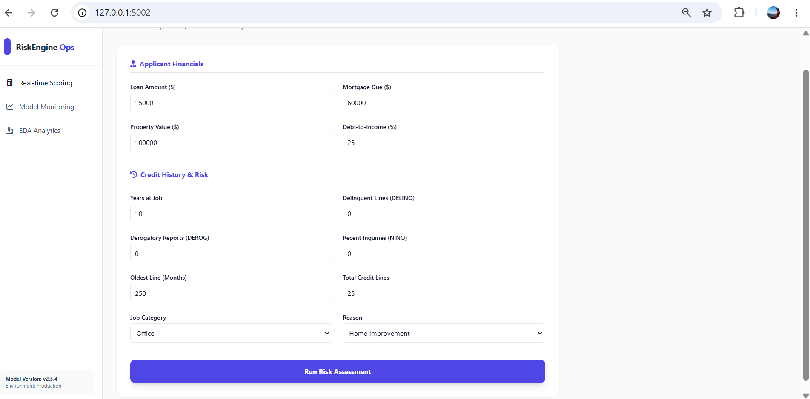
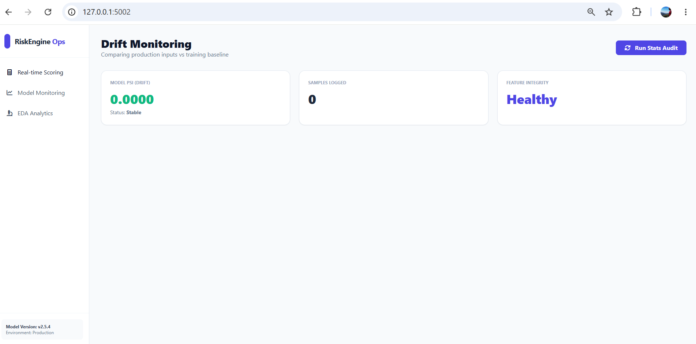
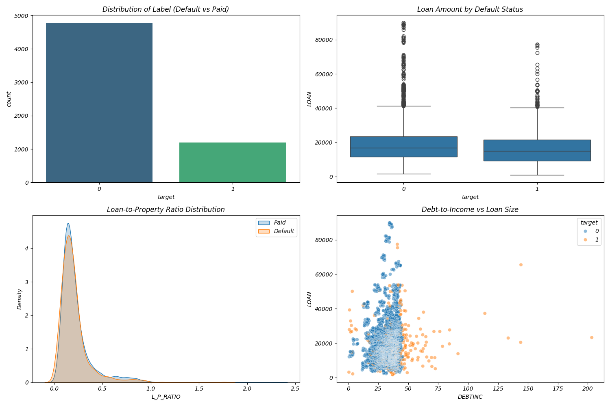
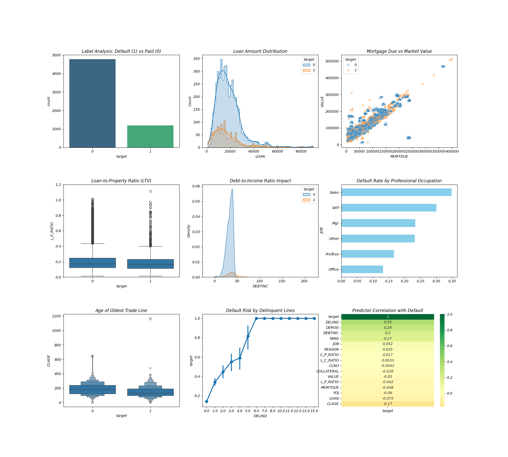

## Overview
This project implements a production-grade credit scoring engine built on the HMEQ (Home Equity Mortgage Questionnaire) dataset. It estimates the Probability of Default (PD) for home equity loan applications and delivers a real-time credit decision through a Flask REST API and browser dashboard.
-Data ingestion from CSV or MySQL
-Feature engineering — six domain-driven financial ratios computed at both training and inference time
-Multiple model families — Logistic Regression, Voting Ensemble, and XGBoost Stacking — all tracked via MLflow
-Real-time scoring through a Flask REST API that returns a probability, a simulated credit score, a risk band, and an automated decision on every call
-Explainability via SHAP reason codes that identify the top risk drivers and mitigating factors for each individual prediction
-Post-deployment monitoring using Population Stability Index (PSI) and KS statistics to detect data and score drift over time
-A browser dashboard with panels for real-time scoring, model monitoring, and EDA analytics
## Dashboard preview
### real time scoring 

### drift analysis

### visualization dashboards

### exhaustive eda reports

## Data Source
The dataset used in this project is the HMEQ (Home Equity Mortgage Questionnaire) dataset — a publicly available collection of 5,960 home equity loan applications from a US-based lender.
Each record represents one borrower and carries a binary label: BAD = 1 means the loan defaulted or became seriously delinquent, BAD = 0 means it was repaid. The class split sits at roughly 80/20 — about 4,771 good loans against 1,189 defaults.
Source: https://www.kaggle.com/datasets/ajay1735/hmeq-data
File: data/raw/hmeq.csv

Records: 5,960

Features: 12 input variables + 1 target (BAD)

Format: CSV, comma-separated, header row included
## project structure
```
credit_risk_ml_system/
│
├── main.py                          # Default entry point
├── master_pipeline.py               # Runs all four model variants
├── app.py                           # Flask API with monitoring (port 5002)
├── app_nomonitoring.py              # Lightweight Flask API (port 5000)
├── config.yaml                      # Central config
├── requirements.txt                 # Dependencies
│
├── data/
│   ├── raw/hmeq.csv                 # Source data, 5,960 records
│   └── processed/                   # Training baseline for drift
│
├── features/
│   └── feature_pipeline.py          # Six engineered features
│
├── models/
│   ├── train_ensemble.py            # Stacking: RF + GBM → LogReg
│   ├── train_boosted.py             # Voting: RF + XGBoost
│   ├── train_voting.py              # Voting: DecisionTree + RF
│   ├── train_logistic.py            # Logistic Regression baseline
│   └── evaluate.py                  # Gini + KS evaluation
│
├── explainability/
│   ├── shap_explainer.py            # Full SHAP explainer
│   └── shap_explainer_simple.py     # Lightweight fallback
│
├── services/
│   └── scoring.py                   # PD → score → band → decision
│
├── monitoring/
│   ├── drift_analysis.py            # PSI and KS calculations
│   ├── drift_scheduler.py           # Scheduled drift checks
│   └── performance.py               # Performance tracker
│
├── registry/
│   └── registry.py                  # MLflow registration
│
├── inference/
│   └── inference.py                 # Loads model, exposes predict()
│
├── artifacts/
│   └── credit_risk_pipeline.pkl     # Serialized champion model
│
├── logs/
│   └── production_predictions.csv   # Every API call logged here
│
├── reports/
│   ├── realtime_scoring_form.png
│   ├── drift_monitoring_dashboard.png
│   ├── eda_analytics_dashboard.png
│   ├── eda_visualizations.png
│   └── exhaustive_eda_visuals.png
│
└── ui/
    └── index.html                   # Browser dashboard
```                   

## Used tools and technology
## Tools & Technologies

| Category | Tool |
|---|---|
| Language | Python 3.8+ |
| Data Processing | Pandas |
| Numerical Computing | NumPy |
| Machine Learning | Scikit-learn |
| Boosting | XGBoost |
| Explainability | SHAP |
| Experiment Tracking | MLflow |
| Model Registry | MLflow Model Registry |
| API Framework | Flask |
| Cross-Origin Support | Flask-CORS |
| Model Serialization | Joblib |
| Statistical Testing | SciPy |
| Configuration | PyYAML |
| Database | SQLite |
| Frontend | HTML / CSS /## Tools & Technologies

## Feature Engineering

Six features computed before any model sees the data.
Same code runs at training and inference time — no drift between environments.

| Feature | Formula | Purpose |
|---|---|---|
| COLLATERAL | VALUE − MORTDUE | Net equity in the property |
| L_P_RATIO | LOAN / VALUE | Loan-to-value ratio |
| L_C_RATIO | LOAN / COLLATERAL | Loan vs net equity |
| C_P_RATIO | COLLATERAL / VALUE | Equity coverage ratio |
| HIGH_DEBTINC_FLAG | 1 if DEBTINC > 45 | Extreme debt burden flag |
| HAS_DEROG | 1 if DEROG > 0 | Any derogatory history |

---

## Model Training

Four model variants — all share the same sklearn Pipeline
(StandardScaler + OneHotEncoder → model).

| Script | Model | Notes |
|---|---|---|
| train_ensemble.py | Stacking: RF + GBM → LogReg | Default champion |
| train_boosted.py | Voting: RF + XGBoost | Highest performance |
| train_voting.py | Voting: DecisionTree + RF | Lightweight option |
| train_logistic.py | Logistic Regression | Interpretable baseline |

Evaluation uses **Gini Coefficient** and **KS Statistic** —
industry-standard credit metrics, not accuracy.

---

## Scoring & Decisioning

PD is converted to a credit score via log-odds scaling:

score = 500 + 50 × ln( (1 − PD) / PD )   clamped to [300, 850]

| Risk Band | PD | Score | Decision |
|---|---|---|---|
| Low Risk | ≤ 25% | ≥ 620 | AUTO-APPROVE |
| Medium Risk | 25–70% | 450–619 | REFER TO UNDERWRITER |
| High Risk | > 70% | < 450 | DECLINE |

---

## API Endpoints
POST /predict          → PD, score, risk band, decision, SHAP reason codes

GET  /api/drift-report → PSI + KS drift metrics

GET  /api/eda-report   → EDA plot as base64 PNG

GET  /                 → Browser dashboard

Example request:

```json
{
  "LOAN": 15000, "MORTDUE": 60000, "VALUE": 100000,
  "DEBTINC": 25.5, "DELINQ": 0, "DEROG": 0,
  "CLAGE": 250, "YOJ": 10, "NINQ": 0, "CLNO": 25,
  "JOB": "ProfExe", "REASON": "HomeImp"
}
```

---

## Monitoring

Every `/predict` call is logged to `logs/production_predictions.csv`.
The system compares production data against the training baseline using:

| Metric | Purpose |
|---|---|
| Score PSI | Distribution shift in predicted probabilities |
| Feature PSI | Distribution shift in DEBTINC |
| KS p-value | Statistical significance of the shift |

| PSI Value | Status |
|---|---|
| < 0.10 | Stable |
| 0.10 – 0.25 | Moderate Shift |
| > 0.25 | Significant Drift — retrain |

---

## MLflow Tracking

Every training run is logged automatically — parameters, metrics, and artifacts.
